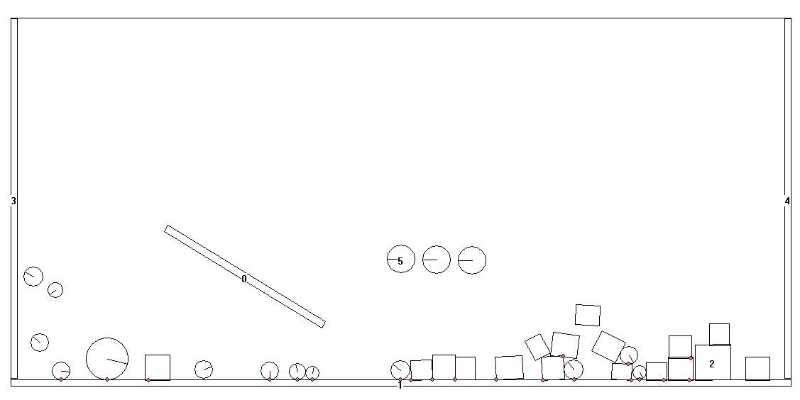

# Physics2D

Dynamics simulator for polygonal & circular 2D objects.

# Demo

## Python

Coming soon!

## C++

### Demo video

### Demo executable

[Download executable demo (.exe)](./C++/demo/Physics_Final.exe)
- **Requirements**
    - Visual C++ Redistributable for Visual Studio 2015
    https://www.microsoft.com/en-US/download/details.aspx?id=48145
    - Windows 10 SDK
    https://developer.microsoft.com/en-us/windows/downloads/windows-sdk/
